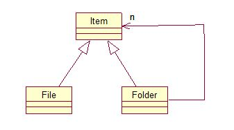

# File System Using Composition Pattern
User can create or delete any file or folder. She can read or write any file. She can change the current directory and can view contents of this directory. The system shall make the data persistent.

